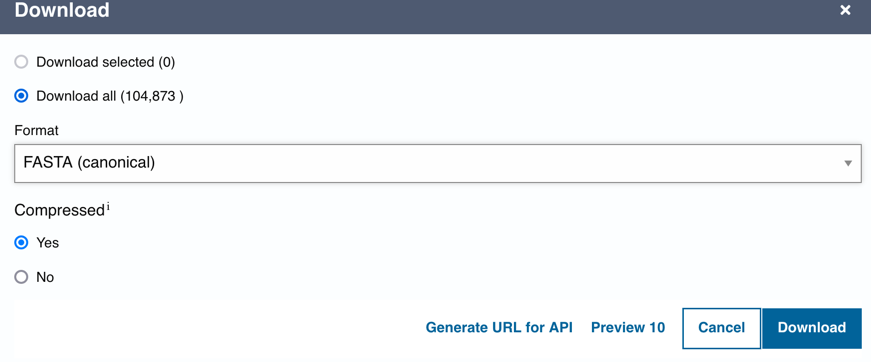

Demo: https://youtu.be/WHGnj_cl2o0

Note a font.tff file is needed at path "font.ttf". 

Fasta Download instructions:

A .fasta file is included in this repository, but to 
use a different one, simply download it from uniprot. 
(The one we used is availible at 
https://www.uniprot.org/uniprotkb?facets=reviewed%3Atrue%2Cproteins_with%3A2&query=%2A 
and includes 104,873 reviewed proteins with an active site)

For larger downloads, compression will be required; simply extract the file after downloading it.
Finally, rename the file to uniprotkb.fasta